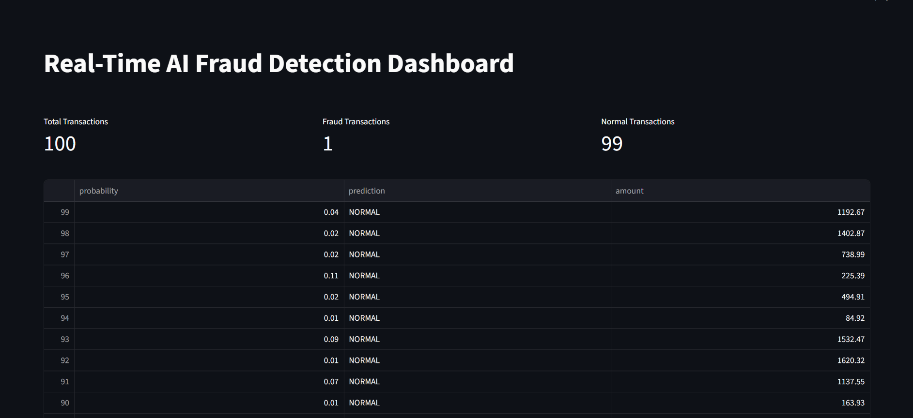
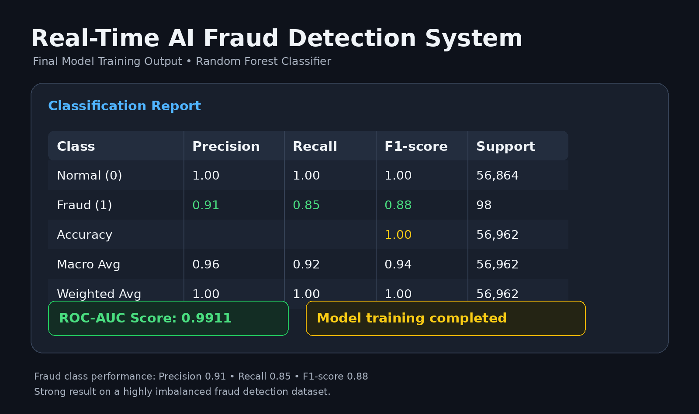
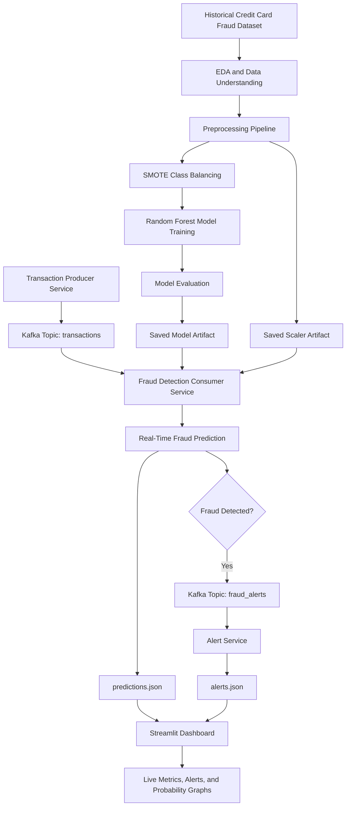
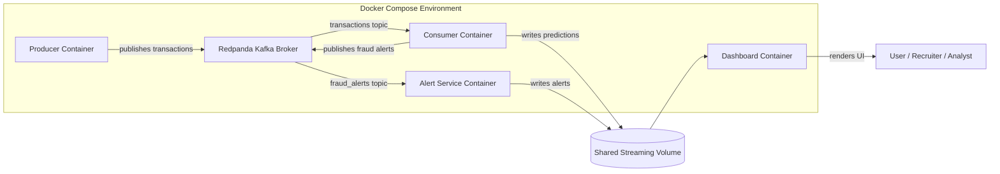
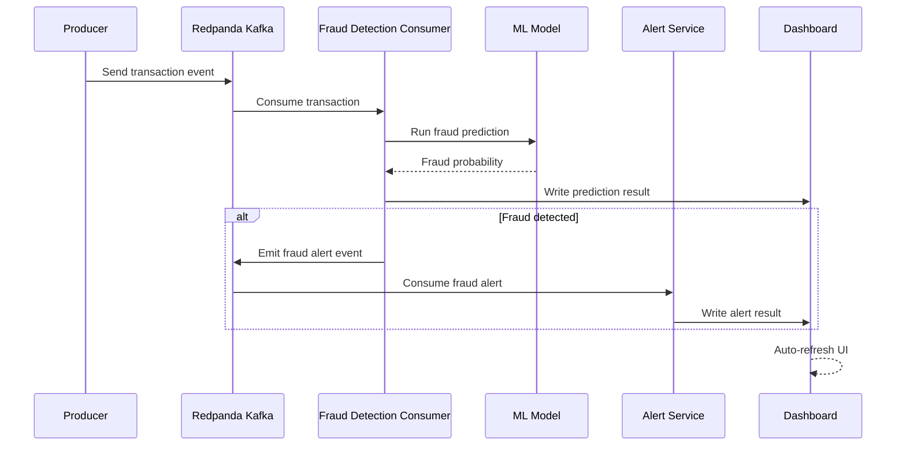
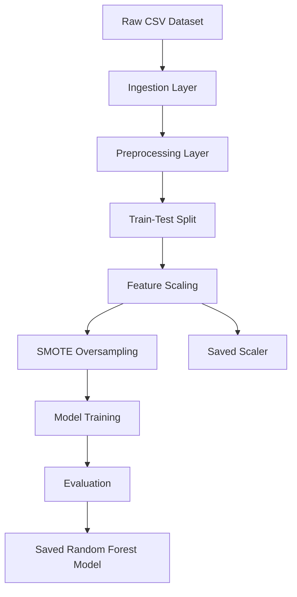

# Real-Time AI Fraud Detection System

A production-style **AI/ML + streaming data engineering project** that detects fraudulent financial transactions in real time using a trained machine learning model, Kafka-compatible event streaming, Dockerized microservices, live alerting, and an interactive monitoring dashboard.

This project is designed to show not only machine learning model training, but also how an AI model can be integrated into a real distributed system.

---

## Project Summary

Most beginner ML projects stop after training a model in a notebook.  
This project goes further by building an end-to-end real-time AI system:

- Historical fraud dataset ingestion
- Exploratory data analysis
- Class imbalance handling
- Machine learning model training
- Model serialization
- Real-time transaction streaming
- Kafka producer-consumer architecture
- Real-time ML inference
- Fraud alert generation
- Live Streamlit dashboard
- Docker Compose orchestration

The complete system can be launched using:

```bash
docker compose up --build
```
## Dataset

This project uses the **Credit Card Fraud Detection Dataset** from Kaggle.

Dataset link:

https://www.kaggle.com/datasets/mlg-ulb/creditcardfraud

After downloading, place the CSV file here:

```text
data/creditcard.csv

---

## Problem Statement

Financial fraud detection is a critical problem in banking, fintech, and payment systems. Fraudulent transactions are rare, fast-moving, and often hidden inside massive transaction streams.

A real fraud detection system must:

- Process transactions continuously
- Detect suspicious activity quickly
- Handle highly imbalanced data
- Generate alerts in real time
- Provide monitoring for analysts
- Run as a reliable distributed system

This project simulates that kind of real-world AI architecture.

---

## Key Features

- Real-time transaction streaming using Kafka-compatible Redpanda
- Machine learning fraud detection using Random Forest
- Handling severe class imbalance using SMOTE
- Modular ML pipeline with ingestion, preprocessing, training, and evaluation layers
- Real-time consumer service for fraud inference
- Fraud alert pipeline using a separate Kafka topic
- Streamlit dashboard for live monitoring
- Docker Compose support for single-command startup
- Event-driven architecture using producer-consumer pattern
- Latest prediction and alert tracking using JSON-based lightweight storage
- Clean project structure suitable for resume and GitHub portfolio

---
## Screenshots

### Real-Time Dashboard



### Graph


### Model Training Output



## Tech Stack

| Category | Technology |
|---|---|
| Programming Language | Python |
| Machine Learning | Scikit-learn |
| Imbalance Handling | SMOTE, imbalanced-learn |
| Data Processing | Pandas, NumPy |
| Model Persistence | Joblib |
| Streaming Platform | Redpanda Kafka |
| Messaging Client | kafka-python |
| Dashboard | Streamlit |
| Containerization | Docker |
| Orchestration | Docker Compose |
| Dataset Source | Kaggle Credit Card Fraud Dataset |

---

## System Architecture



---

## Runtime Microservice Architecture



---

## End-to-End Data Flow



---

## ML Pipeline Architecture



---

## Why This Project Is Different

Many student ML projects only include:

```text
Dataset → Notebook → Accuracy
```

This project includes:

```text
Dataset → ML Pipeline → Saved Model → Kafka Streaming → Real-Time Inference → Alerts → Dashboard → Dockerized Deployment
```

That makes it closer to how real AI systems are built in fintech and banking environments.

---

## Dataset

This project uses the **Credit Card Fraud Detection Dataset** from Kaggle.

Dataset characteristics:

- Highly imbalanced fraud dataset
- Contains anonymized transaction features
- Features `V1` to `V28` are PCA-transformed values
- `Amount` represents transaction amount
- `Class` is the label:
  - `0` = Normal transaction
  - `1` = Fraud transaction

Dataset link:

```text
https://www.kaggle.com/datasets/mlg-ulb/creditcardfraud
```

Place the downloaded file as:

```text
data/creditcard.csv
```

---

## What Are V1 to V28?

The dataset does not expose original banking features because of privacy and security.

Instead, the original transaction attributes were transformed using **PCA**, which stands for Principal Component Analysis.

That means:

- `V1` to `V28` are anonymized mathematical features
- They may represent hidden combinations of original transaction behavior
- Their exact business meaning is unknown
- The ML model learns fraud patterns from their relationships

This is realistic because banks often anonymize sensitive financial data.

---

## Model Performance

The final modular training pipeline produced the following result:

| Class | Precision | Recall | F1-score |
|---|---:|---:|---:|
| Normal | 1.00 | 1.00 | 1.00 |
| Fraud | 0.91 | 0.85 | 0.88 |

Final ROC-AUC Score:

```text
0.9911
```

This is strong performance for a highly imbalanced fraud detection dataset.

---

## Project Structure

```text
ai/
├── data/
│   └── creditcard.csv
│
├── models/
│   ├── random_forest_model.pkl
│   └── scaler.pkl
│
├── notebooks/
│   └── eda.ipynb
│
├── src/
│   ├── ingestion/
│   │   └── load_data.py
│   │
│   ├── preprocessing/
│   │   └── preprocess.py
│   │
│   ├── training/
│   │   └── train_model.py
│   │
│   ├── evaluation/
│   │   └── evaluate.py
│   │
│   ├── streaming/
│   │   ├── producer.py
│   │   ├── consumer.py
│   │   ├── alert_service.py
│   │   ├── predictions.json
│   │   └── alerts.json
│   │
│   └── dashboard/
│       └── dashboard.py
│
├── Dockerfile
├── docker-compose.yml
├── requirements.txt
├── .gitignore
└── README.md
```

---

## Folder Responsibilities

| Folder | Purpose |
|---|---|
| `data/` | Stores raw dataset |
| `notebooks/` | EDA and experimentation |
| `models/` | Saved ML model and scaler |
| `src/ingestion/` | Dataset loading logic |
| `src/preprocessing/` | Scaling, splitting, SMOTE |
| `src/training/` | Production training pipeline |
| `src/evaluation/` | Reusable model evaluation |
| `src/streaming/` | Kafka producer, consumer, alerts |
| `src/dashboard/` | Streamlit dashboard |
| `Dockerfile` | Python application image |
| `docker-compose.yml` | Multi-container orchestration |

---

## Local Setup Without Docker

Create virtual environment:

```bash
python -m venv .venv
```

Activate environment on Windows:

```bash
.venv\Scripts\activate
```

Install dependencies:

```bash
pip install -r requirements.txt
```

Train the model:

```bash
python -m src.training.train_model
```

Start Redpanda manually with Docker:

```bash
docker run -d --name redpanda -p 9092:9092 -p 9644:9644 redpandadata/redpanda:latest redpanda start --overprovisioned --smp 1 --memory 1G --reserve-memory 0M --node-id 0 --check=false
```

Run producer:

```bash
python src/streaming/producer.py
```

Run consumer:

```bash
python src/streaming/consumer.py
```

Run alert service:

```bash
python src/streaming/alert_service.py
```

Run dashboard:

```bash
streamlit run src/dashboard/dashboard.py
```

Open dashboard:

```text
http://localhost:8501
```

---

## Docker Setup

The recommended way to run the full system is Docker Compose.

Build and start all services:

```bash
docker compose up --build
```

Open the dashboard:

```text
http://localhost:8501
```

Stop the system:

```bash
docker compose down
```

---

## Docker Services

| Service | Description |
|---|---|
| `redpanda` | Kafka-compatible event broker |
| `producer` | Generates transaction events |
| `consumer` | Runs ML inference on streamed events |
| `alert_service` | Listens for fraud alert events |
| `dashboard` | Displays predictions and alerts |

---

## How Kafka Works In This Project

The system uses two Kafka topics:

| Topic | Purpose |
|---|---|
| `transactions` | Carries transaction events from producer to consumer |
| `fraud_alerts` | Carries fraud alert events from consumer to alert service |

Flow:

```text
Producer → transactions topic → Consumer → fraud_alerts topic → Alert Service
```

This decouples services and makes the system scalable.

---

## Why Redpanda Instead Of Apache Kafka?

Redpanda is Kafka-compatible but easier to run locally and inside Docker.

Advantages:

- No ZooKeeper needed
- Lightweight setup
- Kafka API compatible
- Works well for development and demos

---

## Dashboard Features

The Streamlit dashboard shows:

- Total processed transactions
- Fraud transaction count
- Normal transaction count
- Live prediction table
- Fraud probability line chart
- Real-time fraud alerts

---

## Important Engineering Concepts Demonstrated

This project demonstrates multiple real-world AI engineering concepts:

### Machine Learning

- Binary classification
- Fraud detection
- Class imbalance handling
- SMOTE oversampling
- Model evaluation using precision, recall, F1-score, ROC-AUC
- Model serialization

### Data Engineering

- Streaming transaction generation
- Kafka topics
- Producer-consumer pattern
- Event-driven architecture

### MLOps

- Modular ML pipeline
- Saved artifacts
- Reusable training and evaluation modules
- Dockerized execution

### Distributed Systems

- Independent services
- Kafka broker communication
- Shared volume for prediction and alert logs
- Docker Compose orchestration

### Monitoring

- Live dashboard
- Fraud alerts
- Real-time metrics

---

## Why Accuracy Alone Is Not Enough

Fraud detection datasets are highly imbalanced.

If 99.8% of transactions are normal, a model can predict every transaction as normal and still get very high accuracy.

That is why this project focuses on:

- Precision
- Recall
- F1-score
- ROC-AUC

For fraud detection, recall is especially important because missing fraud can be costly.

---

## Limitations

This project is a strong simulation, but not a full banking production system.

Current limitations:

- Uses simulated streaming transactions
- Uses JSON files for lightweight dashboard storage
- Does not include real payment gateway integration
- Does not include authentication
- Does not include database persistence
- Does not include model drift monitoring yet

---

## Future Improvements

Possible upgrades:

- PostgreSQL storage for predictions and alerts
- Redis cache for low-latency dashboard updates
- FastAPI inference endpoint
- Email/SMS fraud notification
- Model drift detection
- MLflow experiment tracking
- Grafana + Prometheus monitoring
- Cloud deployment on AWS EC2
- Real-time WebSocket dashboard
- SHAP explainability for model predictions

---

## Resume Description

```text
Built a distributed real-time AI fraud detection platform using Python, Kafka-compatible Redpanda, Scikit-learn, Streamlit, and Docker. Designed a modular ML pipeline with ingestion, preprocessing, SMOTE-based class balancing, Random Forest training, real-time producer-consumer inference, fraud alerting, and live monitoring dashboard.
```

---

## Short Resume Bullet Points

- Built an end-to-end real-time fraud detection system using Kafka, Scikit-learn, Streamlit, and Docker.
- Designed a modular ML pipeline for ingestion, preprocessing, SMOTE balancing, training, evaluation, and inference.
- Implemented event-driven producer-consumer architecture for live transaction processing.
- Achieved 0.9911 ROC-AUC using Random Forest on a highly imbalanced fraud detection dataset.
- Created a real-time dashboard for fraud alerts, prediction monitoring, and transaction analytics.
- Dockerized the complete multi-service system using Docker Compose.

---

## Interview Talking Points

If asked about this project, explain:

1. Why fraud detection is an imbalanced classification problem
2. Why accuracy is misleading for rare fraud events
3. Why SMOTE was used
4. Why Random Forest was selected as final model
5. How Kafka enables real-time streaming
6. How producer and consumer services are decoupled
7. How fraud alerts are emitted through a separate Kafka topic
8. How Docker Compose runs the full distributed system
9. How dashboard monitors predictions in real time
10. How this differs from a normal notebook-only ML project

---

## Final Outcome

This project represents a complete AI engineering workflow:

```text
Research → Model Training → Model Evaluation → Model Serialization → Streaming Inference → Alerting → Monitoring → Dockerized Execution
```

It is designed to demonstrate practical AI/ML system architecture, not just model training.
